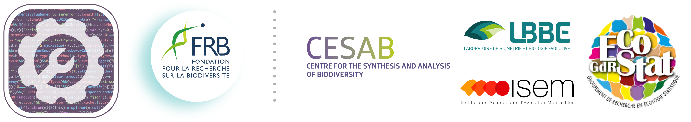

```{r setup, include=FALSE}
knitr::opts_chunk$set(echo = FALSE)
```





<br />


The objective of this five-day workshop, co-organized by the 
[FRB-CESAB](https://www.fondationbiodiversite.fr/en/about-the-foundation/le-cesab/)
and the
[GdR EcoStat](https://sites.google.com/site/gdrecostat/), 
is to train young researchers in reproducibility, software development and 
version management tools (e.g. `R`, `git`, `Rmarkdown`, `tidyverse`, `docker`), 
applied to biodiversity research.


<br />


## Program


**Day 1**

&nbsp;&nbsp;&nbsp;&nbsp;`r fontawesome::fa_i("caret-right")` &nbsp;
Icebreaker and introduction of the week
<br/>&nbsp;&nbsp;&nbsp;&nbsp;`r fontawesome::fa_i("caret-right")` &nbsp;
Open science and Reproducible research
<br/>&nbsp;&nbsp;&nbsp;&nbsp;`r fontawesome::fa_i("caret-right")` &nbsp;
Research compendium
<br/>&nbsp;&nbsp;&nbsp;&nbsp;`r fontawesome::fa_i("caret-right")` &nbsp;
Version control (`git`) and collaboration (GitHub)


**Day 2**

&nbsp;&nbsp;&nbsp;&nbsp;`r fontawesome::fa_i("caret-right")` &nbsp;
Data handling (`dplyr`)
<br/>&nbsp;&nbsp;&nbsp;&nbsp;`r fontawesome::fa_i("caret-right")` &nbsp;
Data visualization (`ggplot2`)
<br/>&nbsp;&nbsp;&nbsp;&nbsp;`r fontawesome::fa_i("caret-right")` &nbsp;
Literate programming (`rmarkdown`)


**Day 3**

&nbsp;&nbsp;&nbsp;&nbsp;`r fontawesome::fa_i("caret-right")` &nbsp;
Optimization and pipeline toolkit (`targets`)
<br/>&nbsp;&nbsp;&nbsp;&nbsp;`r fontawesome::fa_i("caret-right")` &nbsp;
Dealing with R package versions (`renv`)
<br/>&nbsp;&nbsp;&nbsp;&nbsp;`r fontawesome::fa_i("caret-right")` &nbsp;
Containerization (`Docker`)
<br/>&nbsp;&nbsp;&nbsp;&nbsp;`r fontawesome::fa_i("caret-right")` &nbsp;
Building R packages


**Day 4**

&nbsp;&nbsp;&nbsp;&nbsp;`r fontawesome::fa_i("caret-right")` &nbsp;
Subgroups projects


**Day 5**

&nbsp;&nbsp;&nbsp;&nbsp;`r fontawesome::fa_i("caret-right")` &nbsp;
Subgroups projects


<br/>


## Pré-requis


The following software must be installed before the workshop:
[R](https://cran.r-project.org/) (latest version), 
[RStudio](https://rstudio.com/products/rstudio/download/) et 
[git](https://git-scm.com/downloads).
Follow this [tutorial](instructions.html) to install your working environment.

You also need to create an account (free) on [GitHub](https://github.com/signup).


## Corrections {.appendix}


If you see mistakes or want to suggest changes, please 
[Create an issue](https://github.com/rdatatoolbox/rdatatoolbox.github.io/issues)
on the source repository.


## Reuse {.appendix}


The material of this website is licensed under Creative Commons Attribution 
[CC BY 4.0](https://creativecommons.org/licenses/by/4.0/).
Source code is available at https://github.com/rdatatoolbox/rdatatoolbox.github.io/.


## Citation {.appendix}


Casajus N, Dray S, Gimenez O, Guéry L, Guilhaumon F & Schiettekatte NMD (2021) 
Workshop FRB-CESAB & GdR EcoStat: Data Toolbox for Reproducible Research in 
Computational Ecology (Edition 2021). 
Zenodo. <http://doi.org/10.5281/zenodo.4262978>.
